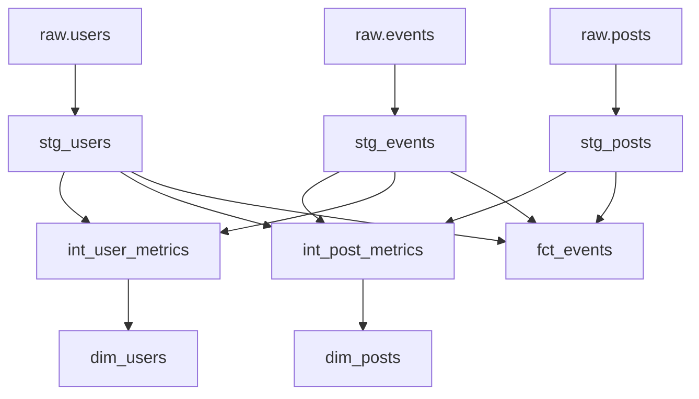

# dbt Models Documentation

This directory contains the dbt transformation models for the event stream demo project.

## Model Architecture

The dbt models follow a three-layer architecture:

### 00_staging/ - Staging Layer
**Purpose:** Clean and standardize raw data
- [`stg_users.sql`](./00_staging/stg_users.sql) - Cleaned user dimension data
- [`stg_posts.sql`](./00_staging/stg_posts.sql) - Cleaned posts data  
- [`stg_events.sql`](./00_staging/stg_events.sql) - Cleaned event fact data
- [`sources.yml`](./00_staging/sources.yml) - Source definitions and tests
- [`schema.yml`](./00_staging/schema.yml) - Staging model tests and documentation

**Materialization:** Views (lightweight, always fresh)

### 01_int/ - Intermediate Layer
**Purpose:** Business logic and aggregations
- [`int_user_metrics.sql`](./01_int/int_user_metrics.sql) - User-level aggregations and classifications
- [`int_post_metrics.sql`](./01_int/int_post_metrics.sql) - Post-level engagement metrics
- [`schema.yml`](./01_int/schema.yml) - Intermediate model tests and documentation

**Materialization:** Tables (optimized for downstream consumption)

### 02_mart/ - Data Mart Layer
**Purpose:** Business-ready dimensional model
- [`dim_users.sql`](./02_mart/dim_users.sql) - User dimension with SCD Type 2
- [`dim_posts.sql`](./02_mart/dim_posts.sql) - Posts dimension with SCD Type 2
- [`fct_events.sql`](./02_mart/fct_events.sql) - Event fact table with daily partitioning
- [`schema.yml`](./02_mart/schema.yml) - Mart model tests and documentation

**Materialization:** Tables/Incremental (production-ready, optimized)

## Data Flow

```
Raw Tables (DuckDB)
    ↓
Staging Models (Views)
    ↓  
Intermediate Models (Tables)
    ↓
Mart Models (Tables/Incremental)
```

## Key Business Metrics

### User Metrics
- **User Type Classification:** inactive, content_creator, consumer, active
- **Creator Tier:** power_creator, regular_creator, casual_creator, non_creator  
- **Engagement Tier:** highly_engaged, moderately_engaged, lightly_engaged, not_engaged

### Post Metrics
- **Engagement Tier:** no_engagement, low_engagement, medium_engagement, high_engagement
- **Content Length:** short, medium, long
- **Shareability Tier:** highly_shareable, moderately_shareable, lightly_shareable, not_shareable

### Event Metrics
- **Engagement Weights:** like=1, share=3, comment=5
- **Temporal Analysis:** hours_since_post_created, days_since_user_created
- **Context Flags:** is_self_interaction, engagement_speed

## Running the Pipeline

```bash
# Run all models
dbt run

# Run specific layer
dbt run --select 00_staging.*
dbt run --select 01_int.*
dbt run --select 02_mart.*

# Run tests
dbt test

# Generate and serve documentation
dbt docs generate
dbt docs serve
```

## TODO: Next Implementation Steps

### High Priority
- [ ] **Implement proper SCD Type 2 logic** using dbt snapshots
- [ ] **Add incremental strategy** for [`fct_events`](./02_mart/fct_events.sql) with partition-based loading
- [ ] **Create dbt snapshots** for tracking historical changes in users and posts
- [ ] **Add data freshness tests** and monitoring

### Medium Priority
- [ ] **Enhanced business logic:**
  - User engagement scoring algorithms
  - Basic user segmentation

### Technical Improvements
- [ ] **Performance optimization:**
  - Implement proper partitioning strategies
  - Implement late-arriving data handling

- [ ] **Data quality:**
  - Custom data quality tests
  - Data validation rules

## Model Dependencies



## Testing Strategy

Each layer includes comprehensive testing:
- **Source tests:** Data quality validation on raw data
- **Staging tests:** Referential integrity and data type validation
- **Intermediate tests:** Business logic validation
- **Mart tests:** Final data quality and relationship validation

## Configuration Notes

- Default materialization is set to `table` in [`dbt_project.yml`](../dbt_project.yml)
- Staging models override to use `view` materialization
- Fact table uses `incremental` materialization for performance
- All models include audit timestamp fields for data lineage